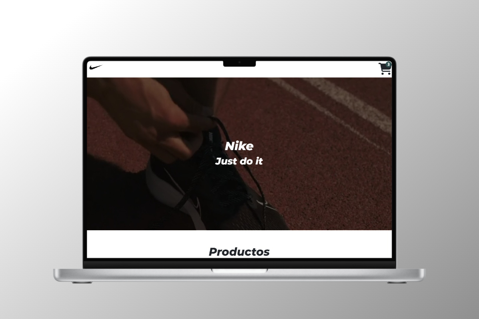
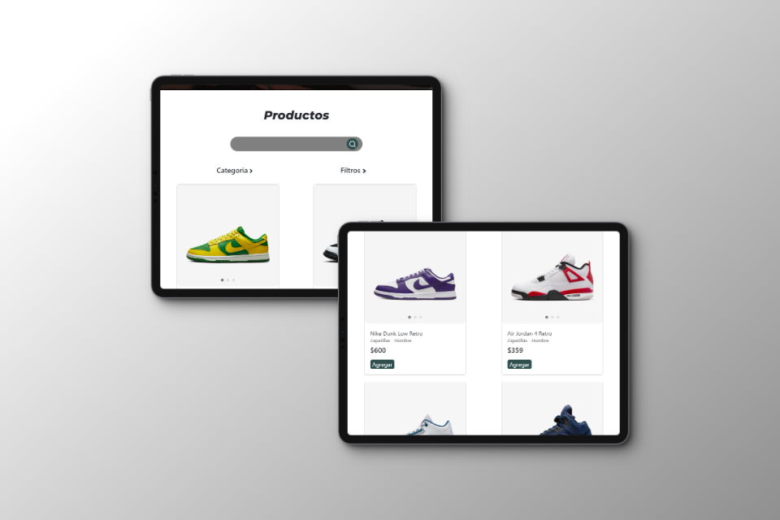
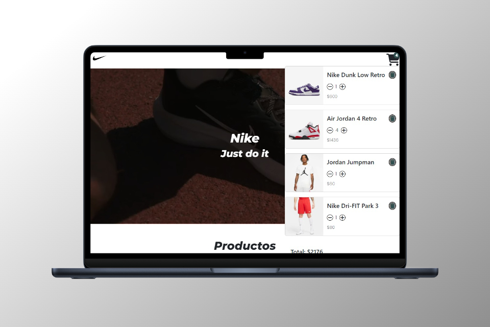
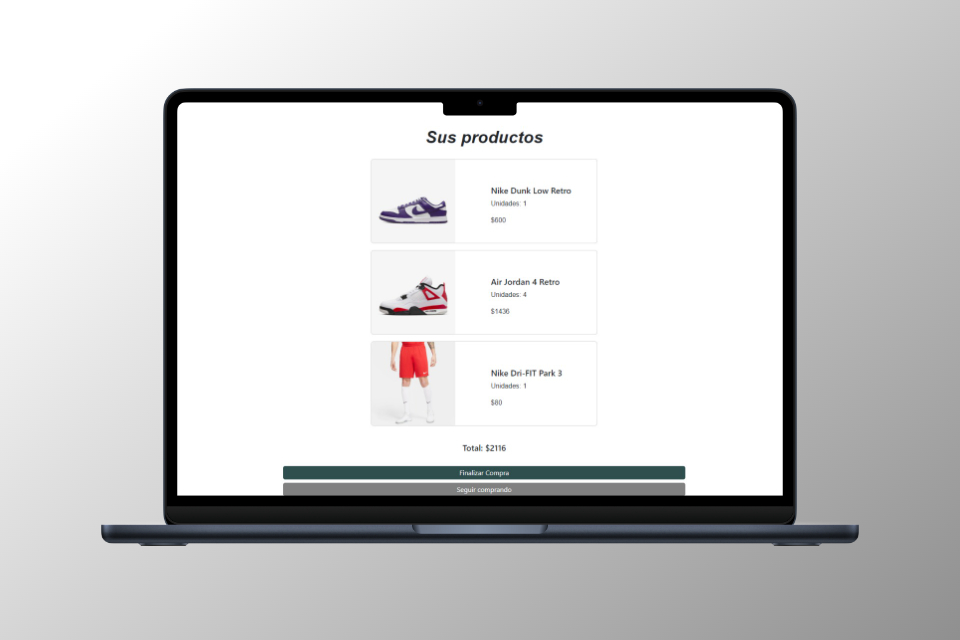

  <h1>Proyecto Final JavaScript - Coderhouse</h1>
  
¡Bienvenido/a al repositorio de mi proyecto final de CoderHouse!

  <h2>Descripción del Proyecto</h2>
  
Este proyecto es el resultado de mi trabajo durante el curso de CoderHouse. Pude crear un sitio web interactivo utilizando HTML, CSS, SASS y JavaScript, haciendo uso de las buenas prácticas de desarrollo y librerías tales como SweetAlert2, Toastify, SwiperJS y EmailJS. Este proyecto es una simulación de un e-commerce, donde los productos fueron obtenidos mediante un fetch, simulando el consumo de una API.

  <h2>Imagenes sobre mi proyecto</h2>
  
  
  
  

  <h2>Donde puedo ver la pagina web?</h2>
  
Podés encontrarla en: https://patriciorodriguez080.github.io/Proyecto-Final-JavaScript/

